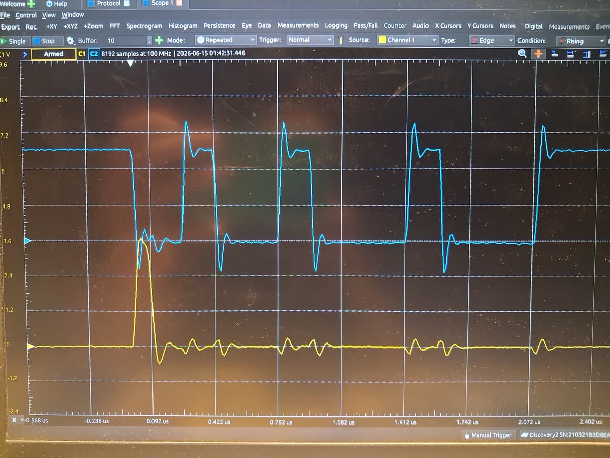
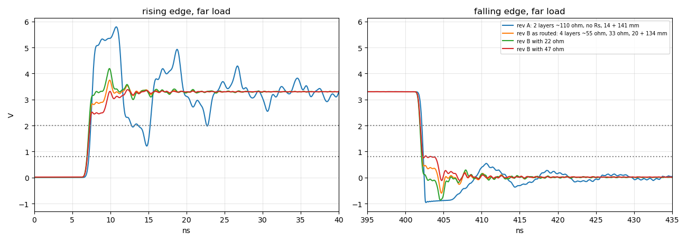
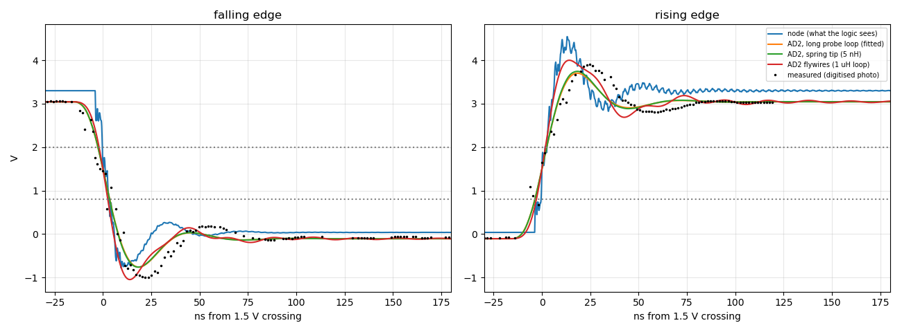

# Electrical design (rev A)

Source: `hardware/kicad/tile/isomorphic_tile.kicad_sch` with the hierarchical sheets
`tile`, `counter`, `keyboard` and `power`.

## Power

- A single 3.3 V rail (`VCC`) comes from the controller and is chained through pin 1 of
  every edge connector. There is no regulator on the tile.
- The key board has its own `VCC_T` / `GND_T` nets, joined to `VCC` / `GND` through the
  stacking connectors (J105/J106 ↔ J108/J107, pins 1 and 8).
- Decoupling on the logic board is 2 × 100 nF (0805), 2 × 4.7 µF (1206) and 1 × 100 µF
  electrolytic (THT).

## Logic parts

The symbol values and the ordered part numbers disagree in rev A. Until the chip markings
of a built tile have been checked, treat the **MPN column** as the intended part.

| Ref | Function | Symbol value (rev A) | MPN (rev A BOM) |
|---|---|---|---|
| U101 | 2× buffer, active-high OE (`L_clk` out, `L_data` in) | 74AUC2G126 | 74LVC2G126DCTRG4 |
| U102 | 2× AND (W, column-end detect) | 74AUC2G08 | SN74LVC2G08IDCTRQ1 |
| U103, U104 | 8-bit PISO shift register | 74HC165 | SN74LVC165ADR |
| U105 | inverter (latch → `~rst`) | 74AHC1G04 | SN74LVC1G04DBVR |
| U106 | 2× OR (latch merge, flag feedback) | 74LVC2G32 | SN74LVC2G32DCTR |
| U107 | 2× buffer, active-low OE (`T_clk` out, `T_data` in) | 74AUC2G125 | SN74LVC2G125DCTR |
| U108 | D flip-flop (column-end flag, `B_W`) | 74LVC2G74 | SN74LVC2G74DCTR |
| U109 | 4-bit counter (frame boundary `Tc`) | 74LS161 | SN74HC161DR |

74AUC parts are specified only up to 2.7 V. They must not be used on the 3.3 V rail.

## Keys

Each key connects `VCC_T` to a node with a 10 kΩ pull-down (R122–R133). A 100 Ω series
resistor (R110–R121) connects that node to the stacking header. Pressed = '1'.

## Signal integrity (rev A)

The 2026-06-15 capture shows the following on the board clock:

- about 40 % overshoot;
- about 1 V undershoot below ground;
- 20–30 MHz ringing after every edge;
- coupled spikes on the neighbouring channel.

Contributing factors found in the rev-A design:

- **No source termination.** The LVC drivers (U101, U107, U104 Q7, U106, U108) have
  about 15–25 Ω output impedance and edges of about 1–2 ns, which is fast enough for a
  few centimetres of track plus a connector to act as a transmission line. They drive the
  inter-board lines directly.
- **Multi-drop nets.** `B_clk` is 141 mm long and joins J103, J104, a pull-up and 6 IC
  inputs. `L_latch` and `B_data` each leave through two connectors.
- **Return path.** The board has 2 layers, with a GND pour on top and a VCC pour on the
  bottom, and both pours are cut up by tracks. Signals on B.Cu are referenced to VCC. The
  edge connectors have few ground pins (J101: 1 of 6; J103: 2 of 8).
- **Measurement set-up.** The Analog Discovery 2 has about 30 MHz of bandwidth, the probe
  had a long ground lead, and the controller link used 20 cm dupont wires without a
  ground alongside. All of these add ringing of their own.

### Rev B (branch `rev-b`)

The rev-B work addresses these points without changing the logic,
the connector pinout or the connector positions. It adds series resistors at the drivers,
per-IC decoupling, a 4-layer stack-up with a solid ground plane, and controlled-impedance
routing of the inter-board nets. Results will be recorded here and in
[the ledger](../LEDGER.md).

Rev-B design, function unchanged:

- 33 Ω series resistors R201–R207 at every driver that leaves the tile: `L_clk`, `T_clk`,
  `L_latch`, `T_latch`, `B_data`, `R_data` and `B_W`. The driver side is named `*_drv`.
- One 100 nF (0603) capacitor next to each logic IC (C201–C209).
- A 4-layer, 1.6 mm stack-up: L1 signal, L2 GND (`GND_T` on the key board), L3 VCC
  (`VCC_T`), L4 signal. The prepreg is 0.21 mm, so the 0.3 mm `Interboard` tracks are about
  55 Ω. There is a 4 mm grid of ground stitching vias.

### Simulation results (`hardware/si/`, updated 2026-09-27)

Models:

- The TI parts use their **vendor IBIS data** (`models/*.ibs`, converted by
  `ibis_lite.py`). LVC outputs switch in about 0.5–0.75 ns, and LVC inputs have **no clamp
  to VCC** (they are 5 V tolerant), so overshoot is not limited by the receivers.
- The pico-ice driver and the dupont link are **calibrated on the rev-A capture**, which
  was digitised from the phone photo (`digitize_scope.py`, `fit_measurement.py`). The AD2
  front end is modelled as 24 pF || 1 MΩ with a 30 MHz Butterworth.

| Tile-to-tile clock hop (IBIS, far load) | Overshoot | Undershoot | Crossings of VIH on a rising edge |
|---|---|---|---|
| rev A (2 layers, ~110 Ω, no series R) | 76 % | −0.96 V | **7: the edge rings back below 2.0 V** |
| rev B as routed (4 layers, ~55 Ω, 33 Ω) | 14 % | −0.60 V | 1 |
| rev B with 22 Ω | 27 % | −0.86 V | 1 |
| rev B with 47 Ω | 2 % | −0.11 V | 1 (but the falling edge dwells on VIL) |

These are lossless, typical-corner models, so they are pessimistic: rev A does work on
the bench. The conclusion is relative: **rev A has little or no margin against double
clocking, rev B with 33 Ω has a large one.** 33 Ω is the right value; 47 Ω makes the far
end step at the threshold.

Controller link (pico-ice → first tile over dupont wires), calibrated model (RMS error
0.20 V against the digitised capture):

- The AD2 view reproduces the capture. The node the logic sees has about **38 %
  overshoot, −0.8 V undershoot and a stepped rising edge**, most of which the 30 MHz AD2
  cannot show.
- A spring ground tip on the AD2 would barely change the picture (RMS 0.207 V vs 0.203 V).
  The instrument bandwidth, not the ground lead, hides the problem. See
  [measuring](../build/measuring.md).
- A series resistor at the pico-ice outputs (on an adapter board), from `controller_fix.py`:

| Series R | Overshoot | Undershoot | Clean single crossings |
|---|---|---|---|
| 0 Ω (today) | 38 % | −0.78 V | no (3 on VIH) |
| 100 Ω | 13 % | −0.35 V | **yes** |
| 150–220 Ω | 1–5 % | ≈0 V | no (slow step on VIH) |

  **Recommendation: 100 Ω.** Confirm it on the bench: the fitted driver resistance ended
  at its bound, so the model is not unique.
