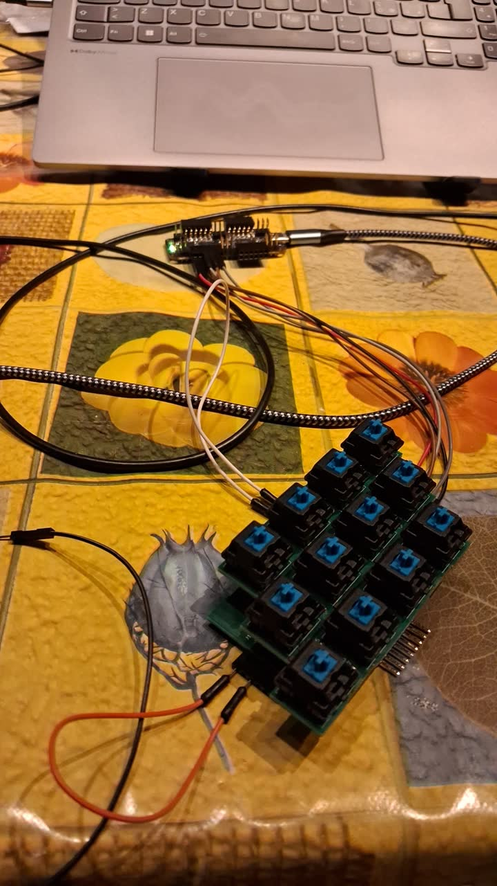

# Mechanical design (rev A)

## Tile

- Board thickness 1.6 mm, 2 layers (rev A).
- The **key board** is 97 × 51 mm with a stepped outline so that neighbouring tiles
  interlock. It carries 12 Cherry MX 1u switches in 3 rows of 4:
  - key pitch 20 mm horizontally;
  - row pitch 17.32 mm (20 mm × sin 60°);
  - each row is shifted by 10 mm, which gives a hexagonal lattice.
- The **logic board** is 73.25 × 45.25 mm and sits under the key board. The two are joined
  by stacking connectors J105/J106 (vertical sockets on the logic board) and J107/J108
  (vertical headers on the key board).
- Both boards are fabricated as one panel. They are joined by two tabs at x = 118.5–132.25
  and x = 159.5–173.25, with 0.5 mm NPTH mouse bites at y = 95.75 and y = 109.
- Tile to tile, the logic boards use right-angle 2.54 mm connectors:

| Ref | Edge | Type |
|---|---|---|
| J101 | left | 1×6 socket, horizontal |
| J104 | right | 1×6 header, horizontal |
| J102 | top | 1×8 socket, horizontal |
| J103 | bottom | 1×8 header, horizontal |

**Frozen for all future revisions:** switch positions, connector positions and rotations,
connector pinouts, and the board outlines. `tools/scripts/check_invariants.py pcb`
enforces the switch and connector positions and the outline against the rev-A reference.
