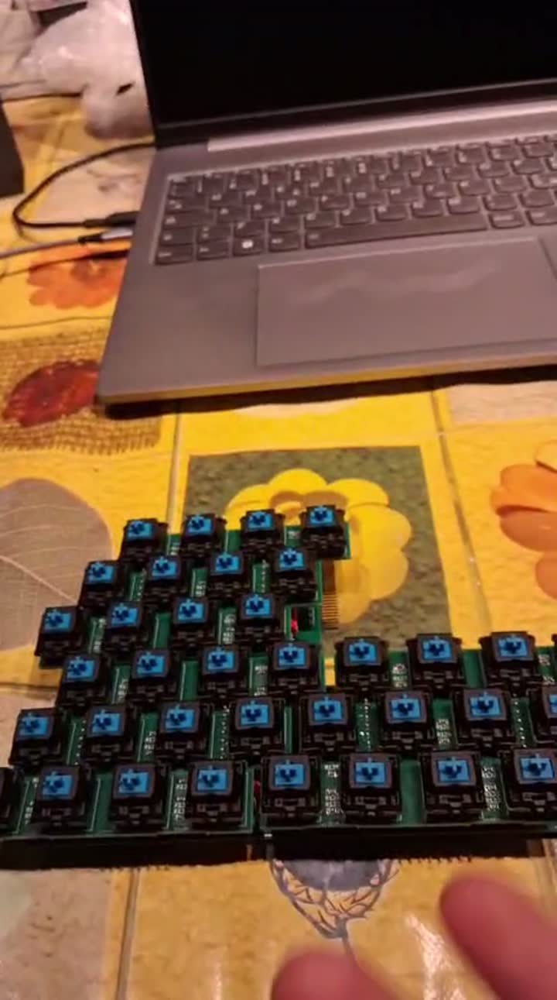

# System overview



The keyboard is built from identical **tiles**. Each tile carries 12 keys on a hexagonal
(isomorphic) lattice. Tiles plug into each other edge to edge (above, below, left, right),
and any contiguous arrangement of columns is read by a single controller. The controller
rediscovers the arrangement on **every scan**, so tiles can be unplugged, moved and
replugged while the instrument is playing. The rev-A prototype does exactly this
(videos of 2026-06-30).

```
             ┌────────┐┌────────┐
             │ tile   ││ tile   │      clock / latch flow up each column and then left
             └───┬────┘└───┬────┘      data flows back down and right
   ┌────────┐┌───┴────┐┌───┴────┐
   │ tile   ││ tile   ││ tile   │
   └────────┘└────────┘└───┬────┘
                           │ J103 (bottom of the bottom-right tile)
                    ┌──────┴──────┐
                    │  pico-ice   │  iCE40UP5K: scan, debounce, MIDI
                    └──────┬──────┘
                           │ MIDI (31250 baud, DIN)
```

## Building blocks

| Block | Where | What |
|---|---|---|
| Key board | `hardware/kicad/tile` (sheet `keyboard`) | 12 Cherry MX switches, 10 kΩ pull-downs, 100 Ω series resistors, stacking headers J107/J108 |
| Logic board | `hardware/kicad/tile` (sheets `tile`, `counter`, `power`) | two '165 shift registers, chaining logic (W buffers, column-end detector), edge connectors J101–J104, stacking sockets J105/J106 |
| Controller | `firmware/ice40` | pico-ice (iCE40UP5K @ 12 MHz): scan FSM, debouncers, change detection, MIDI UART |
| Tile model | `hardware/simulation` | behavioural VHDL model of a tile and grid testbenches |

The key board and the logic board of a tile are two PCBs **stacked** on top of each other
(hence the branch name `double_stack`). They are fabricated together in one panel from a
single KiCad project and separated along mouse-bite tabs.

Further reading:

- [Scan protocol and topology discovery](protocol.md)
- [Electrical design](electrical.md)
- [Mechanical design](mechanical.md)
- [Known issues](../known-issues.md)
