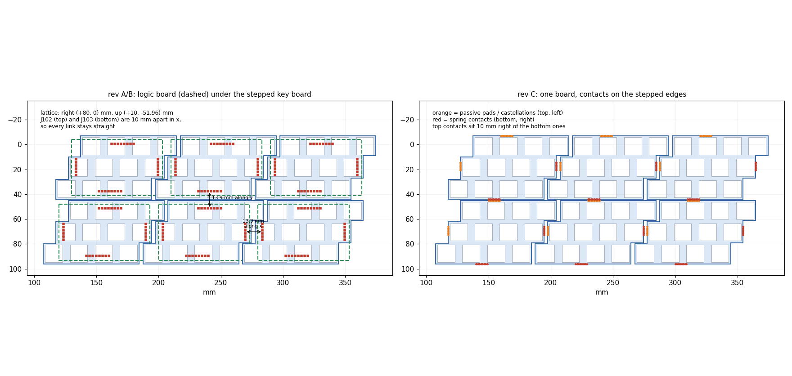
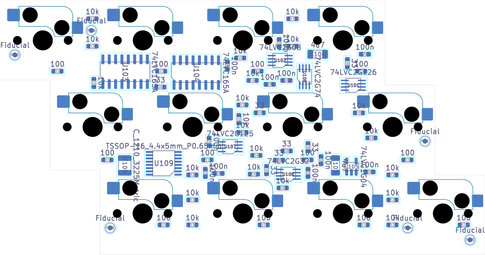
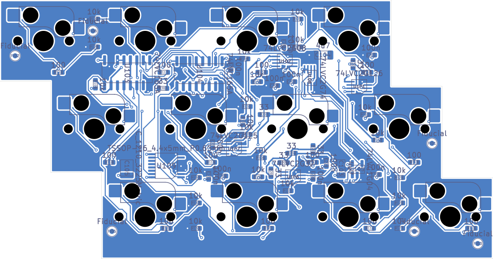

# Rev C study: a single-board tile

Question: can the double stack (key board over logic board) become **one PCB**, keeping
the key lattice and the logic unchanged?

Short answer: **the electronics fit, the edge connectors do not.** A single-board tile is
geometrically possible only with a new tile-to-tile contact system. Such a tile would be a
new generation: it can mate with other rev-C tiles but not with rev-A/B tiles.

All numbers below come from scripts in `hardware/kicad/tile/scripts/revc_*.py` run on the
rev-B board. Outputs are written to `production/revc/`.

## Geometry of the stack (rev A/B)

- The logic board sits under the key board. J105/J106 on the logic board mate with J107/J108
  under the key board, which gives the transform logic → key coordinates
  **(+10.96, −60.90) mm**. Rev A has a 0.04 mm mismatch between the two stacking connector
  pairs.
- Tile lattice (from the edge connectors, 13.9 mm between mated header and socket pads):
  - right neighbour **(+80, 0) mm**, with a 3 mm gap between the key boards;
  - upper neighbour **(+10, −51.96) mm**, which is 3 rows of 17.32 mm, with about 1 mm gap.
- The right-angle 2.54 mm edge connectors live **under** the neighbour's key-board
  overhang, about 11 mm below the keys. That free space is what makes the stack work.

## The skew: oblique tiles, orthogonal links

The key lattice is hexagonal: every row is shifted by 10 mm. The tiles therefore repeat
on an **oblique** lattice (right +80/0 mm, up +10/−51.96 mm), and the key board has a
stepped outline so that neighbours interlock.

**How rev A/B solve it.** The logic board is an ordinary rectangle, and so are its edge
links:

- left/right links are pure x;
- top/bottom links are pure y.

The skew is absorbed by the connector **positions**: the top connector J102 is 10 mm to
the right of the bottom connector J103, which is exactly the lattice shift of the tile
above. The rectangles do not interlock. The 13.9 mm of mated header+socket sit in the
free space under the neighbour's overhanging key board, about 11 mm below the keys.

**How rev C solves it.** The stepped outline is made only of horizontal and vertical
segments, so the links can stay orthogonal on the key board itself:

- **left/right**: the vertical edge segments of the same row face each other with a 3 mm
  gap (row 1: x 204.5 ↔ 207.5, row 2: 194.5 ↔ 197.5, row 3: 184.5 ↔ 187.5), so a contact
  row on the row-2 segment mates along x;
- **top/bottom**: the top edge (y 45, x 127.5–204.5) faces the bottom edge of the tile above
  (y 44.04, x 117.5–194.5) over 67 mm with a 0.96 mm gap, so contacts mate along y. As in
  rev A/B, the top contacts sit 10 mm to the right of the bottom contacts.

The skew is still absorbed by positions, only now at the edges instead of on a hidden
rectangle. The oblique tiling also gives each tile up to 6 neighbours (up-right and
down-left touch too, along short step segments). They are not needed electrically,
because the scan chain uses the same 4 directions as today.

**Putting a tile in place (compare the 2026-06-30 videos).** With 2.54 mm headers a tile
is re-attached by **sliding it sideways** into its neighbour. A tile that has neighbours
on two orthogonal sides has to enter along two directions at once, and this only works
thanks to the play of the pins. Spring contacts with a lead-in (or pogo pins with rounded
tips) plus magnets would let a rev-C tile be **dropped in from above** and pulled into
place, whatever neighbours it has. This is a usability gain, not only a manufacturing one.

## Folding the logic board onto the key-board bottom

`revc_feasibility.py` moves every logic footprint by the stack transform, flips it to the
bottom side (the top carries the switches), removes J105–J108 and the logic-board outline,
and closes the key-board outline.

**Edge connectors at their rev-A/B positions: 61 conflicts.** Every pin of J101–J104 lands
under a switch body (the THT pin end would stick up into the switch). Many of them also
hit a 4 mm centre hole, a 3 mm switch-pin hole, a 1.75 mm peg hole, or a hot-swap socket
pad. The connectors cannot stay where they are.

**Logic parts:** with the collision-free placer from rev B:

| Variant | Placed | No room |
|---|---|---|
| rev-B parts as they are | 40 / 42 | U109 (SOIC-16), C105 (6.3 mm electrolytic) |
| U109 as TSSOP-16 (same chip, SN74HC161PWR), C105 as a 1210 ceramic | **42 / 42** | – |

The same logic ICs and the same schematic function fit between the hot-swap sockets on
the bottom of the key board. Changing only the package of U109 is not a logic change.

## Room for tile-to-tile contacts

`revc_edges.py` measures the free windows along every edge on the bottom side. It keeps
0.5 mm clear of the switch holes (the switch posts stick out below the board) and 0.3 mm
clear of the socket pads and courtyards. Main results:

| Edge | At 0.5 mm from the edge | At 2 mm | At 4 mm |
|---|---|---|---|
| top (77 mm) | 76.4 mm continuous | windows of 6.2 mm (between sockets) | 4.2 mm |
| bottom segments | 10–27 mm | 10–27 mm | 10–27 mm |
| left segments (16–18 mm) | 9–10 mm | 7.7–10.3 mm | 6.8–8.1 mm |
| right segments (16–18 mm) | 15–17 mm | 11–12 mm | 6.4–7.1 mm |

Consequences:

- A 2.54 mm right-angle header (≥ 8 mm deep) cannot sit at any edge.
- A contact row at 1.27 mm pitch fits: 6 contacts = 7.6 mm and 8 contacts = 10.2 mm.
  It fits on every edge if the **passive half** (castellated half-holes or edge pads,
  ≤ 0.5 mm deep) is on the **top and left** edges, where only a thin strip is free, and the
  **active half** (spring contacts or right-angle pogo pins, 2–4 mm deep) is on the
  **bottom and right** edges, where the windows are deep.
- The gaps to the neighbours are about 3 mm (left/right) and about 1 mm (top/bottom). That
  is within the travel of common spring contacts. Magnets in the free bottom windows would
  give alignment and retention.
- Hot-plug: make the GND contact first-mate (longer spring or wider pad), as rev A/B
  implicitly do.

## Could the edge connectors stay through-hole (everything else SMD)?

No. `revc_tht_search.py` tries **every** position (0.25 mm grid) for a right-angle THT edge
connector:

- 1x6 columns for left/right, 1x8 rows for top/bottom;
- 2.54 mm pitch (1.7 mm pads) and 1.27 mm pitch (1.0 mm pads).

A position is valid only if:

- the pads are fully on the board, with 0.3 mm to the edge;
- on the switch side, no pad lands in a switch body or hole;
- on the bottom, the connector body has a clear corridor from the pin row to the edge (no
  socket, no switch post).

**Result: 0 feasible positions on every edge, for both pitches.** On the top side the switch
bodies come within 1.1–1.5 mm of every edge, so a THT pad near the edge is impossible.
Further inside, the body would have to run under a row of switches (posts, sockets) to
reach the edge. So a single-board tile is necessarily **all-SMD, connectors included**
(SMD right-angle 1.27 mm pairs, or spring contacts + pads).

## Pros and cons

| | Double stack (rev A/B) | Single board (rev C concept) |
|---|---|---|
| PCBs per tile | 2 (1 panel) | 1 |
| Hand-soldered parts | 4 edge + 4 stacking connectors | none (springs/castellations are SMD or part of the PCB) |
| Height | about 11 mm stack + switches | 1.6 mm + switches |
| Tile-to-tile link | robust 2.54 mm headers, also the mechanical joint | spring contacts + magnets; mechanical design needed |
| Compatible with rev A/B tiles | yes | **no** (the contacts are at a different height) |
| Interchangeable key layouts on one logic board | yes | no |
| Assembly | two sides (key board B, logic board F) | one side (bottom) + switches pushed in |

## Routability

`revc_route_test.py` runs the rev-B flow on the folded board:

1. merge the stacking-connector nets 1:1 (`BTNs_L<k>` ↔ `BTNs<k>`, `VCC_T`/`GND_T` →
   `VCC`/`GND`);
2. inner GND/VCC planes over the whole board and power fan-out;
3. Freerouting, then ground pours and zone fill.

Result: **routed completely, KiCad DRC 0 errors and 0 unconnected items.** The edge
contacts are not on the board yet. Remaining warnings: silkscreen and library notes.

## Verdict and next steps

1. A single-board tile is **feasible**. The same logic fits and routes on the bottom of the
   key board with 4 layers; only U109 changes package (TSSOP-16) and C105 becomes a 1210
   ceramic.
2. It needs a **new edge-contact system**: castellations on the top and left edges, spring
   contacts on the bottom and right edges, and magnets. The 2.54 mm headers cannot be used.
   This is the real design work: part selection (contact travel ≥ gap tolerance), contact
   resistance on the clock/latch nets, first-mate GND, and mechanical retention.
3. Rev-C tiles would be a new generation, not mixable with rev A/B, unless an adapter tile
   is made.
4. Prototype suggestion before committing: order one rev-B panel (the function is proven)
   and, in parallel, a small rev-C test coupon with two half-tiles to qualify the spring
   contacts for hot-plug and for the SI of the scan clock through a spring contact.
